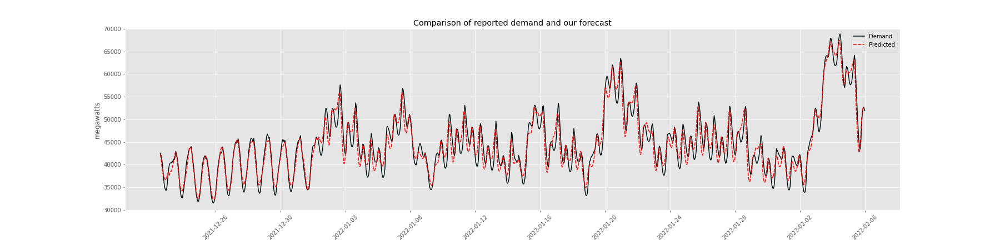

#  

# The Energy Grid: A Texas Case Study
#### Brock Bigalke, Kendall Frimodig, Katie Hickok, Joel Silverman
#### General Assembly DSI Project 05
#### February 07, 2022
---

### PROBLEM STATEMENT

**Can we empower people to make informed decisions about their power usage?**
 
 
     
 

---

### BACKGROUND
The impact of Winter Storm Uri on the Texas power grid during February 2021 was catastrophic and a reminder of the growing degradation of the US electric grid. Persistent freezing temperatures caused wind turbines, nuclear power plants, and natural gas plants (which were already suffering from fuel shortages) to go offline, thereby decreasing the supply of electricity to a populace who was simultaneously increasing demand to stay warm and survive the storm. As the supply couldn’t keep up with the demand throughout the storm, the Electric Reliability Council of Texas (ERCOT) ordered rolling blackouts in order to avoid a complete collapse of the Texas power grid [[1]](#sources_cited). Around 10 million people were affected, 246 people died, and $130 billion in damages were attributed to the storm [[1]](#sources_cited)[[2]](#sources_cited). These occurrences will become increasingly common as climate change exacerbates weather conditions and the weather grid continues to deteriorate. The US has more power outages than any developed country in the world due to aging facilities and deferred maintenance. The current status of the grid is untenable and will continue to impact the health and safety of all citizens [[3]](#sources_cited). 
  

In 2020, the US consumed more than 3.8 billion MW hours of electricity with about 39% going to supply the residential sector (most of this being heating and cooling). These energy sources come from fossil fuels, such as natural gas, coal, and oil, and from renewables including, nuclear, wind, hydropower, solar, geothermal, and biomass. From a national perspective, the most used sources are natural gas, nuclear, and coal, but renewables are slowly becoming more predominant as technology improves and when the weather conditions are right [[4]](#sources_cited)[[5]](#sources_cited). The energy that reaches your home is from a variety of different sources and power plants that are most often located in your state or balancing authority region. Energy is lost the further away it travels from the source, therefore keeping electricity use close to the generation source helps to minimize this inefficiency. As this is the case, it is imperative for each balancing authority to reliably predict and match demand within its own regional net power generation.

**Sources Cited:**  
1. Busby et al, "Cascading risks: Understanding the 2021 winter blackout in Texas." Energy Research & Social Science, Volume 77, 2021, 102106, ISSN 2214-6296 https://doi.org/10.1016/j.erss.2021.102106  
2. Svitek, P. "Texas puts final estimate of winter storm death toll at 246." The Texas Tribune, 3 Jan. 2022, https://www.texastribune.org/2022/01/02/texas-winter-storm-final-death-toll-246  
3. Chrobak, U. "The US has more power outages than any other developed country. Here’s why." Popular Science, 17 Aug. 2020, https://www.popsci.com/story/environment/why-us-lose-power-storms  
4. "Energy Explained: Use of Electricity." EIA, 7 Apr. 2021,  https://www.eia.gov/energyexplained/electricity/use-of-electricity.php#:~:text=Electricity%20consumption%20in%20the%20United,important%20to%20the%20U.S.%20economy.)  
5. "Energy Explained: Electricity in the US." EIA, 18, Mar. 2021. https://www.eia.gov/energyexplained/electricity/electricity-in-the-us.php)  

---

### NOTEBOOKS 

* [api_functions.ipynb](./notebooks/api_functions.ipynb) - Notebook containing functions to make dataframes from the EIA API regardless of query or plant.
* [initial_models.ipynb](./notebooks/initial_models.ipynb) - Notebook with time series models: moving average, single exponential smoothing, and triple exponential smoothing. 
* [viz.ipynb](./notebooks/viz.ipynb) - Notebook with exploratory data analysis visuals: moving average, single exponential smoothing, and triple exponential smoothing. 
* [viz_2.ipynb](./notebooks/viz_2.ipynb) - A second notebook of exploratory data analysis figures: including plots of energy sources and energy demand averaged over different time intervals.   
* [model_interpretation.ipynb](./notebooks/model_interpretation.ipynb) - Comparison of the EIA Forecast archive since 2018 and our model results, against hourly demand.
* [my_functions.py](./notebooks/my_functions.py) - Functions called in various notebooks

### DATASETS

* [all_erco_energy_cst.csv](./data/all_erco_energy_cst.csv) - Dataset containing all information pulled from the EIA API for th ERCO balancing authority in CST
* [all_erco_energy.csv](./data/all_erco_energy.csv) - Dataset containing all information pulled from the EIA API for th ERCO balancing authority in UTC
* [erco_energy.csv](./data/erco_energy.csv) - Demand and Generation by Source for the above in UTC.
* [erco_forecast.csv](./data/erco_forecast.csv) - Forecast for the same data as above in UTC.

|FEATURE|TYPE|DESCRIPTION|
|---|---|---|
|**datetime**|*object*|Date and time of energy info in YMDH-TZ| 
|**demand**|*float64*|Total demand for energy (MW)| 
|**plant**|*object*|Name of balancing authority| 
|**net_generation**|*float64*|Net generation of all energy sources in the balancing authorities’ grid (MW)| 
|**coal**|*float64*|Generation from coal (MW)| 
|**hydro**|*float64*|Generation from hydropower (MW)| 
|**natural_gas**|*float64*|Generation from natural gas (MW)| 
|**nuclear**|*float64*|Generation from nuclear (MW)| 
|**other**|*float64*|Generation from other types of sources including biomass and geothermal (MW)| 
|**solar**|*float64*|Generation from solar (MW)|
|**wind**|*float64*|Generation from wind (MW)| 
|**total_interchange**|*float64*|Sum off all interchange between a balancing authority and its interconnected neighbors (MW)| 
|**forecast**|*float64*|Balancing authority’s predictions of the demand for the day-ahead (MW)|
---

### CONCLUSIONS AND FURTHER RESEARCH
As events like the 2021 Texas power crisis become more common with climate change and aging US energy grid infrastructure, it becomes increasingly important for the public to understand where their power comes from and how overall energy demand may affect them. In our exploratory data visualizations we show patterns of renewable power generation that can be useful for individuals who are interested in timing their use to minimize their carbon footprint. For example, individuals can use this type of demand forecast to time their power usage to lower cost times, such as for electric vehicle charging. Providing accurate energy demand forecasts are also important for energy grid operators. We developed a simple set of 1 hour forecast models that have the advantage of being fast and scalable (as opposed to ARIMA forecasts and others). Our triple smoothed exponential models are a good choice for streaming forecasts online. In addition, these types of models are not as influenced by long-past exogenous events such as previous-annual holidays. This allows them to follow recent patterns better. 

Our next goal is to create a site where people can view the average breakdown of the source of their electricity along with a predicted price available on an hourly basis. We will utilize the api functions along with the models we created to predict demand to ultimately aid in predicting the electricity price for residents. The next steps will be to find sources of electricity data that we can pull on a regular basis to tune our models on and feed into a Streamlit app that end-users can interact with. We believe that giving end-users the ability to know what their electricity price will be in the future along with the composition of the sources will allow them to make informed decisions on their energy use.
